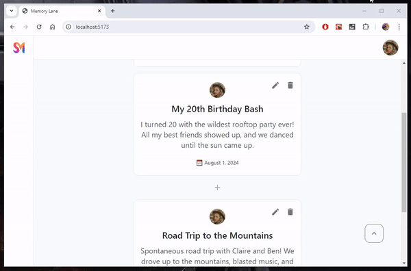

# Documentation Format

This documentation provides an overview of UX/UI decisions made during development, highlighting design choices and technical intricacies for a better user experience.

In addition, I will share my thoughts on certain implementations or missing features. Although not everything will be implemented, I want to address these concerns in a clear and concise manner.

> This is an example of a thought.

Let's get started.

# First Look

The interface is designed to be minimalistic yet intuitive, guiding users without overwhelming them.

## App Frame

### 🎯 UX/UI Design Decisions

- **Top Navigation**: Added a top navigation bar with user-specific features, such as the logged-in profile and notifications.

- **Side Navigation**: Added a side navigation bar displaying the app logo and modules. It could be hidden on smaller screens and toggled via a burger menu.

> To enhance the user experience on smaller screens (tablet/phone), the side navigation would be hidden by default. Users could access the navigation menu by clicking on a burger icon, which overlays it on top of the content. This structure is commonly used in modern apps. **Although not implemented in this project**, it provides a clear framework for future development.

> For fun, I generated a **logo using Midjourney**. The app would be named **SharedMemories (SM)**.

## Page Design

### 🎯 UX/UI Design Decisions

- **Your Memory Lane**: I decided to go with this title because it clearly communicates the purpose of the page, keeping it personal to the user.

- **Share button**: I placed this button next to the page's title for better visibility and to clearly indicate its association with the page.

- **Memory Cards Placeholder**: When the page is empty, a message "A blank canvas, waiting..." creates the impression of an art board, hinting at the memories that will soon fill the space.

- **Inviting User Engagement**: Instead of displaying a form, an inviting input message encourages users to share their memories. Clicking on the input triggers a modal with the actual form, maintaining a clean UI while providing additional functionality.

- **Back to Top Button**: Added a button on the bottom-right corner for easy navigation back to the Share Button.

---

# Memory Form Modal

## Creating a new memory

### 🎯 UX/UI Design Decisions

- **Date Set to Today**: The date is automatically set to the current date when creating a memory, saving time for the user. If needed, the user can manually select a different date using the date picker.

- **Expanded Description Field**: An expanded textarea field allows for more space to view and write the description.

- **Multiple way to close Modal**: The user can close the modal by clicking the Close button, selecting cancel, or clicking outside the modal. This provides flexibility and convenience.

> While reviewing this modal, one improvement that crossed my mind is adding a `tabIndex={0}` to the first field. This would allow the user to start writing immediately, enhancing the overall user experience.

### 🔧 Technical Decisions

- **MUI Library**: Utilizing the MUI Library for its extensive collection of components and functionalities, providing pre-built UI elements and built-in accessibility features for an inclusive user experience.

- **React Hook Form Library**: Opting for the React Hook Form Library to streamline form creation in React, simplifying form handling with intuitive hooks and utilities for efficient validation, submission, and error handling.

- **Modal Reusability for Creating and Editing Memories**: To streamline the process and minimize code duplication, I opted to utilize the same modal component for both creating and editing memories. This approach allows for efficient management of both scenarios while keeping the codebase concise. See [MemoryFormModal.tsx](./src/components/MemoryFormModal.tsx) for the implementation details.

> I went with `@mui/icons-material` package for this project.
> I didn't remove `@heroicons/react`.

## Errors & Validations

### 🎯 UX/UI Design Decisions

- **Error highlighting**: To enhance user experience, fields with errors are visually highlighted in red, allowing users to easily identify and correct their input.

- **Multiple error messages possible**: If there are multiple errors, each field will display its respective error message. This allows users to address each issue individually and ensure a smooth form submission process.

- **No future date allowed**: To ensure data integrity, the form will not submit if the selected date is in the future.

> This happens when the user tries to submit an invalid form.

---

# Memory Card

### 🎯 UX/UI Design Decisions

- **Add Memory Button in-between Memories**: To enhance user experience, I decided to place a **Add Memory** button in-between memories. This allows users to easily add a new memory next to an existing one without navigating through different dates.

- **Red for Delete**: I chose the color red to represent the delete action, as it is commonly associated with caution and warning. This color choice helps users easily identify and differentiate the delete option from other actions.

- **Date proximity to Add Memory Button**: This design choice aims to assist users in determining whether they want to add a memory at this specific location. The date will be automatically selected from the previous memory card, streamlining the process.

> ⭐ Ideally I would have added a **Confirmation Modal** for the **Delete Action**. In this case, I decided to mention it in here instead to save some work.

> I wanted to make something different from the mockup, so I decided to center the elements and go for another look.

### 🔧 Technical Decisions

- **Displaying All Actions**: Initially, I considered hiding the card actions inside a `<Menu />` component. However, this added unnecessary complexity to the code, as I had to anchor the menu. Ultimately, I decided to keep the actions visible since there are only two options.

---

# Planned coding challenge: Memory lane

**Please avoid initiating pull requests on this repository or forking this repository. To submit your solution, either set up a repository on your own account or forward a zip file to the appropriate contact within our talent team.**

### Problem definition

After a series of discovery calls we found out a problem that our users are facing. They are having a hard time sharing their memories with friends and family. They are using a combination of social media, messaging apps, and email to share their memories. They are looking for a solution that allows them to store and share their memories in a single place.

As a first iteration for this solution, we want to build a web application that allows users to create a memory lane and share it with friends and family. A memory lane is a collection of events that happened in a chronological order. Each event consists of a title, a description, a timestamp, and at least one image.

## Deliverables

- Clone this repository and create a new branch with your name. Open a pull request on your own instance of the repository.
- An updated README providing a high level explanation of your implementation.
- **Screenshots or a short video/gif** showing your UI implementation.
- Update the API to accommodate for your technical design. Run the API by using `npm run serve:api`.
- The provided mockup is only for reference and inspiration. Feel free to improve it!

### FAQ

- **Can I add a framework like Next?** If you have the time, go for it, we want to see you use your favorite tools.
- **Is user authentication required?** No, it is not required.
- **Can I use a component library?** Yes, you can use a component library.
- **What will you be looking for?** Good user experience, reusable code, and a well thought out technical design.

### Inspiration mockup

